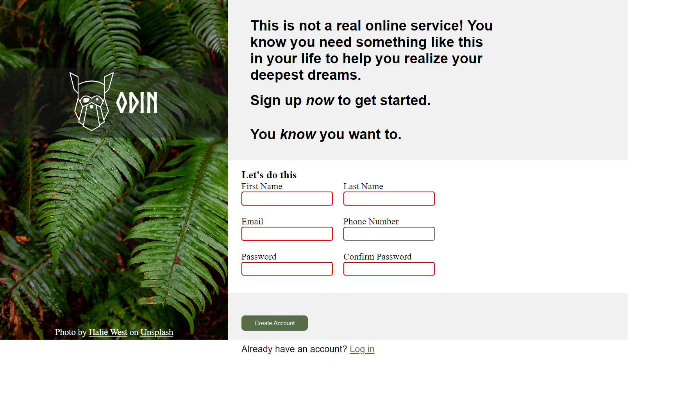

# Odin Signup Page

This project is a signup page template designed using HTML and CSS. The signup page features a split-screen layout with a background image on one side and a signup form on the other side.

## Description

The Odin Signup Page provides a visually appealing and user-friendly interface for users to sign up for a service or application. The page utilizes modern design principles and techniques to create an engaging signup experience.

## Technologies and Techniques Used

- **HTML**: Used to structure the content of the signup page, including headings, paragraphs, forms, and input fields.
- **CSS**: Utilized for styling the page layout, fonts, colors, backgrounds, and overall visual appearance.
- **Flexbox**: Employed to create a responsive layout with two columns, ensuring proper alignment and distribution of content.
- **Font Embedding**: Implemented the `@font-face` rule to embed custom fonts (`Norse-Bold`) for styling text elements.
- **Responsive Design**: Designed the signup page to be responsive across various devices and screen sizes, ensuring a consistent user experience.
- **Form Validation**: Implemented HTML5 form validation attributes (`required`) to ensure that users provide necessary information when signing up.
- **External Image**: Utilized an external image from Unsplash as the background image for the picture column, providing visual interest and context to the page.

## Credits
This Ruby Project is part of the curriculum provided by [The Odin Project](https://www.theodinproject.com/), an open-source online platform that offers free resources to learn web development.
- **Website**: [The Odin Project](https://www.theodinproject.com/)
- **Project**: [Sign up form](https://www.theodinproject.com/lessons/intermediate-html-and-css-sign-up-form)
- **Halie West**: Provided the background photo used in the picture column. [View on Unsplash](https://unsplash.com/photos/25xggax4bSA?utm_source=unsplash&utm_medium=referral&utm_content=creditCopyText)

## Demo

